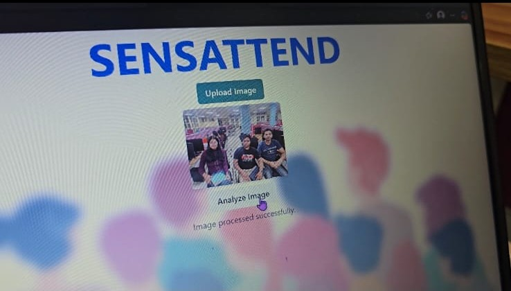

SensAttend – Smart Attendance System Using Face Recognition

SensAttend is an **AI-powered automatic attendance system** that marks student attendance by detecting and recognizing faces from classroom images. The system eliminates manual attendance and improves accuracy, speed, and efficiency using computer vision and machine learning techniques.

---

## Features

* Automatic attendance marking
* Face detection from group classroom images
* Student registration using face dataset
* Roll number mapping with faces
* Real-time face recognition
* Attendance export to CSV/Excel
* High accuracy and fast processing

---

## Tech Stack

* **Python**
* **OpenCV** – Face detection & image processing
* **NumPy** – Numerical operations
* **Machine Learning Models** – Face recognition training
* **Jupyter Notebook** – Development & experimentation

---

## 📂 Project Structure

```
SensAttend/
│
├── client/        # Frontend or image capture related files
├── server/        # Backend processing and recognition logic
├── research/      # Training models and experiments
├── samples/       # Sample images and datasets
├── dataset/       # Student face images
└── attendance.csv # Generated attendance file
```

---

## How It Works

### Step 1: Student Registration

* Capture multiple images of each student
* Store images with roll number mapping

### Step 2: Model Training

* Extract facial features
* Train recognition model

### Step 3: Classroom Image Capture

* Capture group classroom image

### Step 4: Face Detection

* Detect multiple faces from the image

### Step 5: Face Recognition

* Match detected faces with trained dataset

### Step 6: Attendance Marking

* Automatically mark present students
* Save attendance to CSV/Excel file

---

## Output Format (Example)

| Roll Number | Status  |
| ----------- | ------- |
| 101         | Present |
| 102         | Absent  |
| 103         | Present |

---

## Installation & Setup

### 1️⃣ Clone Repository

```
git clone https://github.com/Ishika-Gambhir/SensAttend.git
cd SensAttend
```

### 2️⃣ Install Dependencies

```
pip install opencv-python numpy pandas matplotlib
```

### 3️⃣ Run Project

* Open Jupyter Notebook
* Run training file
* Capture classroom image
* Execute recognition script

---

## Use Cases

* Classroom attendance
* Office employee tracking
* Hostel entry monitoring
* Examination verification

---

## Advantages

* Saves time
* Reduces proxy attendance
* Improves accuracy
* Fully automated
* Easy to use

---

## Limitations

* Performance depends on image quality
* Low lighting may affect accuracy
* Requires proper camera angle

--

## License

This project is for **educational and research purposes**.

---
## Project Demonstration

### SensAttend Mobile/Web Interface
This screen shows the main interface where users can upload classroom images for attendance processing.



---

### Classroom Image Capture
Live classroom image captured for face detection and attendance processing.


---

### Image Analysis & Processing
Uploaded classroom image being analyzed by the system using face recognition algorithms.


---

### Attendance Result Display
Final attendance results displayed after successful face recognition and matching.


<p align="center">
  
</p>
